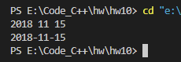
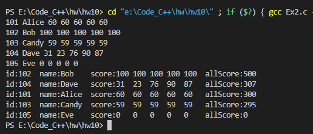
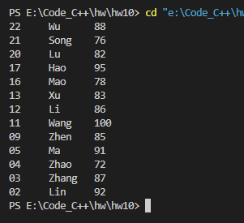
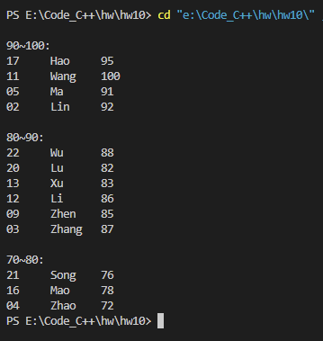

# Ex1

##### 源代码

```c
#include <stdio.h>

struct DATE
{
    int year;
    int month;
    int day;
};

int main() {

    struct DATE date = {2018, 11, 15};

    scanf("%d%d%d", &date.year, &date.month, &date.day);
    printf("%d-%d-%d", date.year, date.month, date.day);

    return 0;
}
```


##### 运行结果




# Ex2

##### 源代码

```c
#include <stdio.h>

struct STUDENT
{
    int id;
    char name[5];
    int score[5];
    int allScore;
};

void print(struct STUDENT s) {
    printf("id:%d  name:%-5s  score:%-3d %-3d %-3d %-3d %-3d  allScore:%d\n", s.id, s.name, s.score[0], s.score[1], s.score[2], s.score[3], s.score[4], s.allScore);
}

void change(struct STUDENT *s1, struct STUDENT *s2) {
    struct STUDENT temp = *s1;
    *s1 = *s2;
    *s2 = temp;
}

int main() {

    struct STUDENT student[5];

    for (int i = 0; i < 5; i++) {
        scanf("%d %s", &student[i].id, &student[i].name);
        student[i].allScore = 0;
        for (int j = 0; j < 5; j++) {
            scanf("%d", &student[i].score[j]);
            student[i].allScore += student[i].score[j];
        }
    }

    for (int i = 0; i < 4; i++) {
        for (int j = i + 1; j < 5; j++) {
            if (student[i].allScore < student[j].allScore) {
                change(&student[i], &student[j]);
            }
        }
    }

    for (int i = 0; i < 5; i++) {
        print(student[i]);
    }

    return 0;
}
```


##### 运行结果




# Ex11

##### 源代码

```c
#include <stdio.h>
#include <stdlib.h>
#include <string.h>
#define STUDENT struct Student
#define STUNODE struct Stunode

STUDENT {
    int num;
    char name[10];
    int grade;
} student[13] = {{2, "Lin", 92},
                 {3, "Zhang", 87},
                 {4, "Zhao", 72},
                 {5, "Ma", 91},
                 {9, "Zhen", 85},
                 {11, "Wang", 100},
                 {12, "Li", 86},
                 {13, "Xu", 83},
                 {16, "Mao", 78},
                 {17, "Hao", 95},
                 {20, "Lu", 82},
                 {21, "Song", 76},
                 {22, "Wu", 88}};   

STUNODE {
    int num;
    char name[10];
    int grade;
    STUNODE *next; 
};

int main() {

    STUNODE *p, *head, *q;
    head = NULL;
    q = NULL;

    for (int i = 0; i < 13; i++) {
        p = (STUNODE*)malloc(sizeof(STUNODE));
        p->num = student[i].num;
        strcpy(p->name, student[i].name);
        p->grade = student[i].grade;
        
        p->next = head;
        head = p;
    }

    while(p != NULL) {
        printf("%02d     %-5s   %d\n", p->num, p->name, p->grade);
        q = p;
        p = p->next;
        free(q);
    }

    return 0;
}
```


##### 运行结果




# Ex12

##### 源代码

```c
#include <stdio.h>
#include <stdlib.h>
// #include <string.h>
#define STUDENT struct Student
#define STUNODE struct Stunode

STUDENT {
    int num;
    char name[10];
    int grade;
}
student[13] = {{2, "Lin", 92},
               {3, "Zhang", 87},
               {4, "Zhao", 72},
               {5, "Ma", 91},
               {9, "Zhen", 85},
               {11, "Wang", 100},
               {12, "Li", 86},
               {13, "Xu", 83},
               {16, "Mao", 78},
               {17, "Hao", 95},
               {20, "Lu", 82},
               {21, "Song", 76},
               {22, "Wu", 88}};

STUNODE {
    STUDENT *data;
    STUNODE *next;
};

int main() {

    STUNODE *head1 = NULL, *head2 = NULL, *head3 = NULL;
    STUNODE *p, *q = NULL; 

    for(int i = 0; i < 13; i++) {
        p = (STUNODE *)malloc(sizeof(STUNODE *));

        switch (10 - (int)(student[i].grade / 10)) {
        case 0:
        case 1:
            p->data = &student[i];
            p->next = head1;
            head1 = p;
            break;
        case 2:
            p->data = &student[i];
            p->next = head2;
            head2 = p;
            break;
        case 3:
            p->data = &student[i];
            p->next = head3;
            head3 = p;
            break;
        }
    }

    // 90~100
    printf("\n90~100:\n");
    p = head1;
    while (p != NULL) {
        printf("%02d     %-5s   %d\n", p->data->num, p->data->name, p->data->grade);
        q = p;
        p = p->next;
        free(q);
    }
    // 80~90
    printf("\n80~90:\n");
    p = head2;
    while (p != NULL) {
        printf("%02d     %-5s   %d\n", p->data->num, p->data->name, p->data->grade);
        q = p;
        p = p->next;
        free(q);
    }
    // 70~80
    printf("\n70~80:\n");
    p = head3;
    while (p != NULL) {
        printf("%02d     %-5s   %d\n", p->data->num, p->data->name, p->data->grade);
        q = p;
        p = p->next;
        free(q);
    }

    return 0;
}
```


##### 运行结果



