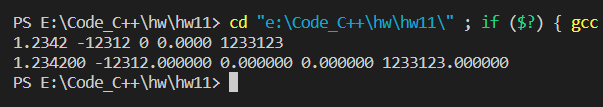
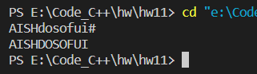
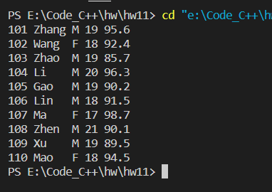

p.343  1，2， 6

# Ex1

##### 源代码

```c
#include <stdio.h>

int main() {

    FILE *fp;
    int count = 5;

    if ((fp = fopen("fdate.dat", "w")) == NULL) {
        printf("cannot open this file");
        return 0;
    }
    for (int i = 0; i < count; i++) {
        double num;
        scanf("%lf", &num);
        fprintf(fp, "%lf ", num);
    }
    fclose(fp);

    if ((fp = fopen("fdate.dat", "r")) == NULL) {
        printf("cannot open this file");
        return 0;
    }
    for (int i = 0; i < count; i++) {
        double num;
        fscanf(fp, "%lf", &num);
        printf("%lf ", num);
    }
    fclose(fp);

    return 0;
}
```


##### 运行结果




# Ex2

##### 源代码

```c
#include <stdio.h>

int main() {

    FILE *fp;
    char c;

    if ((fp = fopen("upper.txt", "w")) == NULL) {
        printf("cannot open the file");
        return 0;
    }
    c = ' ';
    while (c != '#') {
        c = getchar();
        fputc(c, fp);
    }
    fclose(fp);

    if ((fp = fopen("upper.txt", "r")) == NULL) {
        printf("cannot open the file");
        return 0;
    }
    c = ' ';
    while (1) {
        c = fgetc(fp);
        if (c == '#') {
            break;
        }
        if ('a' <= c && c <= 'z') {
            c += ('A' - 'a');
        }
        printf("%c", c);
    }
    fclose(fp);

    return 0;
}
```


##### 运行结果




# Ex6

##### 源代码

```c
#include <stdio.h>
#define STUDENT struct Student

STUDENT {
    char num[7];
    char name[8];
    char gender[3];
    char age[5];
    char grade[9];
} 
stu[10] = {
    {"101", "Zhang", "M", "19", "95.6"},
    {"102", "Wang",  "F", "18", "92.4"},
    {"103", "Zhao",  "M", "19", "85.7"},
    {"104", "Li",    "M", "20", "96.3"},
    {"105", "Gao",   "M", "19", "90.2"},
    {"106", "Lin",   "M", "18", "91.5"},
    {"107", "Ma",    "F", "17", "98.7"},
    {"108", "Zhen",  "M", "21", "90.1"},
    {"109", "Xu",    "M", "19", "89.5"},
    {"110", "Mao",   "F", "18", "94.5"}
};

void display(STUDENT s[], int size) {
    for (int i = 0; i < size; i++) {
        printf("%-3s %-5s %-1s %-2s %-4s\n", s[i].num, s[i].name, s[i].gender, s[i].age, s[i].grade);
    }
}

int main() {

    FILE *fp;
    STUDENT stu2[10];

    if ((fp = fopen("stu.dat", "w+b")) == NULL) {
        printf("cannot open this file\n");
        return 0;
    }
    fwrite(stu, sizeof(STUDENT), 10, fp);
    fclose(fp);

    if ((fp = fopen("stu.dat", "r+b")) == NULL) {
        printf("cannot open this file");
        return 0;
    }
    fread(stu2, sizeof(STUDENT), 10, fp);
    fclose(fp);

    display(stu2, 10);

    return 0;
}
```


##### 运行结果


