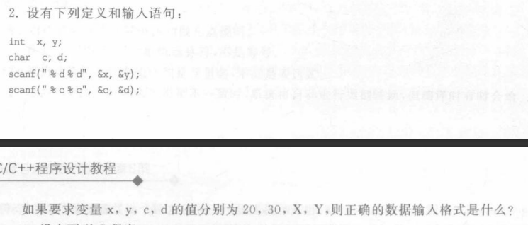
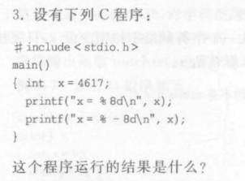
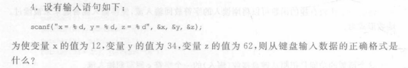
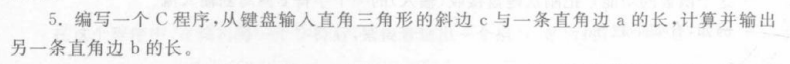
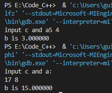
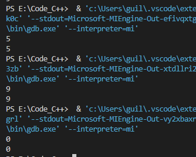

# 第3次作业

## Ex2



正确输入格式为`20 30XY`

## Ex3



```powershell
x=    4617
x=4617
```

## Ex4



` x=12, y=34, z=62 `

## Ex5




##### 源程序

```c
#include<stdio.h>
#include<math.h>

int main(){

    float a, c;

    printf("input c and a:\n");
    scanf("%f%f", &c, &a);
    printf("b is %f", sqrt(c * c - a * a));

    return 0;
}
```

##### 运行结果



## Ex6

##### 源程序

```C
#include<stdio.h>

int main(){

    char x;
    int y;

    scanf("%c", &x);
    y = (int) x - '0';
    printf("%d", y);

    return 0;
}
```


##### 运行结果


