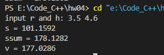
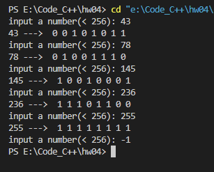

# 第4次作业

## Ex1
`0`，`1`，`0`，`1`，`0`  

## Ex2
`1`，`0`，`1`，`0`，`1`，`0`  

## Ex3
1.`x % 2 == 0 && y % 2 == 1`
2.等价于a和b不能是一奇一偶：`(a + b) % 2 != 1`
3.`(!a || !b) && a + b != 0`
4.`(x > 10 && x < 100) || (x < 0 && x != -2.0)`
5.`1.0/sqrt(2*3.1415926)*exp(-x*x/2)`
6.`r1*r1 <= sqrt(x*x + y*y) && sqrt(x*x + y*y) <= r2*r2`
7.`m % 5 == 0 && m % 7 == 0 && m % 35 != 0`
8.`m % p == 0 && n % p == 0 && m % q != 0 && n % q != 0`
9.`(x * y + (x + y) / (4 * a)) / 2`
10.`sin(x*x + y*y) * cos(x + y) / 3`

## Ex8
`b=13, c=11, d=18`  

## Ex9
`b=13, c=20, d=18`  

## Ex10
`b=13, c=20, d=27`  

## Ex12

##### 源代码

```c
#include <stdio.h>

int main() {

    const double pi = 3.14159;
    double r, h;
    printf("input r and h: ");
    scanf("%lf %lf", &r, &h);

    printf("s = %.4lf\n", 2 * pi * r * h);
    printf("ssum = %.4lf\n", 2 * pi * r * h + 2 * pi * r * r);
    printf("v = %.4lf\n", pi * r * r * h);

    return 0;
}
```

##### 运行结果



## Ex13

##### 源代码

```c
#include <stdio.h>

void bin(int n) {
    int b[8] = {0};
    for (int i = 0; i < 8; i++) {
        if (n) {
            b[7 - i] = n % 2;
            n /= 2;
        }
        else
            break;
    }

    for (int i = 0; i < 8; i++) {
        printf("%2d", b[i]);
    }
}

int main() {

    int n;
    
    for (int i = 0; i < 8; i++) {
        printf("input a number(< 256): ");
        scanf("%d", &n);
        if (n > 255 || n < 0)
            break;
        printf("%d ---> ", n);

        bin(n);
        printf("\n");
    }

    return 0;
}
```
##### 运行结果


