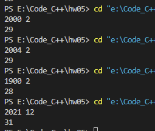
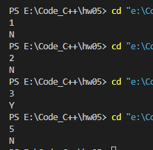
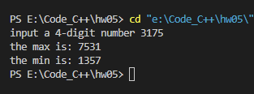

# 第5次作业

## Ex2

`5`

## Ex4

`3`

## Ex7

`0`

## Ex11

```c
#include <stdio.h>

int main() {

    int y, m;
    scanf("%d %d", &y, &m);

    if (((y % 4 == 0 && y % 100 != 0) || y % 400 == 0) && m == 2)
        printf("29");
    else {
        if (m == 1 || m == 3 || m == 5 || m == 7 || m == 8 || m == 10 || m == 12)
            printf("31");
        else if (m == 2)
            printf("28");
        else
            printf("30");
    }

    return 0;
}
```

##### 运行结果



## Ex14

##### 源代码

```c
#include <stdio.h>
#include <math.h>

int isroot(int x) {
    if (pow(x, 4) - 3 * pow(x, 2) - 8 * x - 30 == 0)
        return 1;
    else
        return 0;
}

int main() {

    int x;
    scanf("%d", &x);

    if (isroot(x))
        printf("Y");
    else
        printf("N");

    return 0;
}
```

##### 运行结果



## Ex19

```c
#include <stdio.h>

int main() {

    int a0, a1, a2, a3, a4, t;
    printf("input a 4-digit number ");
    scanf("%d", &a0);
    if (a0 < 1000 || a0 > 9999) {
        printf("invalid input");
        return 0;
    }

    a1 = a0 % 10;
    a2 = a0 % 100 / 10;
    a3 = a0 % 1000 / 100;
    a4 = a0 / 1000;

    // 从大到小排列
    if (a1 < a2) {
        t = a1; a1 = a2; a2 = t;
    }
    if (a1 < a3) {
        t = a1; a1 = a3; a3 = t;
    }
    if (a1 < a4) {
        t = a1; a1 = a4; a4 = t;
    }
    if (a2 < a3) {
        t = a2; a2 = a3; a3 = t;
    }
    if (a2 < a4) {
        t = a2; a2 = a4; a4 = t;
    }
    if (a3 < a4) {
        t = a3; a3 = a4; a4 = t;
    }

    printf("the max is: %d%d%d%d\n", a1, a2, a3, a4);
    printf("the min is: %d%d%d%d\n", a4, a3, a2, a1);

    return 0;
}
```

##### 运行结果

