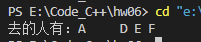

习题 1,3,4,7,10,11,12

## Ex1

##### 源代码

```c
#include <stdio.h>

int main() {

    int x, isPrime;
    printf("input a positive number: ");
    scanf("%d", &x);

    isPrime = 1;
    for (int i = 2; i < x / 2; i++) {
        if (x % i == 0) {
            isPrime = 0;
            break;
        }
    }

    // 如果是素数，则输出本身并结束程序
    if (isPrime) {
        printf("%d", x);
        return 0;
    }

    // 如果不是，输出所有因数
    for (int i = 2; i <= x / 2; i++) {
        if (x % i == 0) {
            printf("%d ", i);
        }
    }

    return 0;
}
```


##### 运行结果


## Ex3
##### 源代码
```c
#include <stdio.h>
#include <math.h>

int main() {

    double x;
    printf("input a number: ");
    scanf("%lf", &x);

    double item = 1, s = 1;
    for (int i = 1; fabs(item) >= 0.000001; i++) {
        item = item * (0.5 - i + 1) * x / i;
        s += item;
    }
    
    printf("%lf", s);

    return 0;
}
```
##### 运行结果


## Ex4
##### 源代码
```c
#include <stdio.h>

int main() {

    int n;
    double s = 1;
    printf("input a number: ");
    scanf("%d", &n);

    for (double i = 1; i < n; i++) {
        s += (i + 1) / i;
    }
    printf("%lf", s);

    return 0;
}
```
##### 运行结果


## Ex7
##### 源代码
```c
#include <stdio.h>

int main() {

    double x, sumPos = 0, sumNeg = 0;
    int countPos = 0, countNeg = 0;
    for (int i = 0; i < 30; i++) {
        scanf("%lf", &x);
        if (x > 0) {
            sumPos += x;
            countPos++;
        }
        else {
            sumNeg += x;
            if (x != 0)
                countNeg ++;
        }
    }

    printf("所有正数之和为：%lf\n", sumPos);
    printf("所有负数之和为：%lf\n", sumNeg);
    printf("所有数的绝对值之和为：%lf\n", sumPos - sumNeg);
    printf("正数的个数为：%d\n", countPos);
    printf("负数的个数为：%d\n", countNeg);

    return 0;
}
```
##### 运行结果


## Ex10
##### 源代码
```c
#include <stdio.h>
#include <math.h>

int main() {

    int flag[1000] = {0};  // 0: prime       1: composite number
    int sum = 0;

    // 筛法找质数
    for (int i = 2; i < sqrt(1000); i++) {
        for (int j = 2; i * j <= 1000; j++) {
            flag[i * j] = 1;
        }
    }

    printf("最小素数：");
    int count = 0;
    for (int i = 2; i <= 1000; i++) {
        if (!flag[i]) {                 // flag[i]为0即是素数，为1则是合数
            printf("%d, ", i);
            flag[i] = 1;                // 把flag[i]当作合数，保证后续不会被输出
            count++;
            sum += i;
        }
        if (count == 10)
            break;
    }
    printf("\n");

    printf("最大素数：");
    count = 0;
    for (int i = 999; i >= 2; i--) {
        if (!flag[i]) {
            printf("%d, ", i);
            count++;
            sum += i;
        }
        if (count == 10)
            break;
    }
    printf("\n");

    printf("素数之和：%d\n", sum);

    return 0;
}
```
##### 结构化流程


##### 运行结果


## Ex11
##### 源代码
```c
#include <stdio.h>

int main() {

    int count = 6;
    while (1) {
        int temp = count;                 // 记录当前苹果的数量
        for (int i = 0; i < 5; i++) {     // 根据题意，苹果数量减1后能整除5，并且该步骤能重复5次
            if ((count - 1) % 5 == 0) {   
                count = (count - 1) / 5 * 4;  
            }
            else {
                count = temp;             // 该数量不符合条件，将数量还原
                break;
            }             
        }
        if (count != temp) {              // count不等于temp意味着count满足条件了
            printf("the minimum quantity is: %d", temp);
            break;
        }
        count++;                          // 不满足条件，数量+1，继续尝试
    }

    return 0;
}
```
##### 结构化流程


##### 运行结果


## Ex12
##### 源代码
```c
#include <stdio.h>

int main() {

    int a, b, c, d, e, f; 

    // 0表示不去，1表示去
    for (a = 0; a <= 1; a++) {
        for (b = 0; b <= 1; b++) {
            for (c = 0; c <= 1; c++) {
                for (d = 0; d <= 1; d++) {
                    for (e = 0; e <= 1; e++) {
                        for (f = 0; f <= 1; f++) {
                            if ((c || (!c && !b))   // 若C不去则B不去
                            && (c + d == 1)         // C和D两人去一个
                            && (d == e)             // D和E要么都去，要么都不去
                            && (a + b + f == 2)     // A，B，F三人去两个
                            && (c + f != 2)         // C和F不能一起去
                            && (e + f != 0)) {      // E和F至少去一个
                                printf("去的人有：%c %c %c %c %c %c",
                                       a == 1 ? 'A' : ' ',
                                       b == 1 ? 'B' : ' ',
                                       c == 1 ? 'C' : ' ',
                                       d == 1 ? 'D' : ' ',
                                       e == 1 ? 'E' : ' ',
                                       f == 1 ? 'F' : ' ');
                            }
                        }
                    }
                }
            }
        }
    }
    
    return 0;
}
```
##### 结构化流程


##### 运行结果

