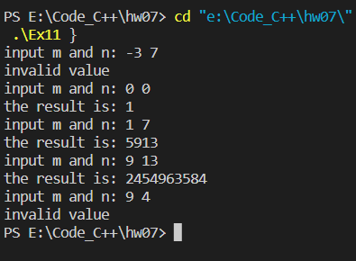

习题 1，2，6，7，10，11

## Ex1

##### 源代码

```c
#include <stdio.h>
#include <math.h>

double getArea(double a, double b, double c) {
    double p = (a + b + c) / 2;
    return sqrt(p * (p - a) * (p - b) * (p - c));
}

int main(){

    double a, b, c;

    printf("input a, b and c: ");
    scanf("%lf%lf%lf", &a, &b, &c);
    printf("the area is: %lf", getArea(a, b, c));

    return 0;
}
```


##### 运行结果


## Ex2
##### 源代码
```c
#include <stdio.h>

double p(int m, int n) {
    if (n == 1)
        return m;
    return m * p(m - 1, n - 1);
}

int main() {

    int m, n;

    printf("input m and n: ");
    scanf("%d%d", &m, &n);
    printf("the factorial is: %lf", p(m, n));

    return 0;
}
```
##### 运行结果


## Ex6
##### 源代码
```c
#include <stdio.h>

int fib(int n) {
    if (n <= 2)
        return 1;
    return fib(n - 1) + fib(n - 2);
}

int main() {

    int n;

    printf("input n: ");
    scanf("%d", &n);
    printf("the n_th fibonacci number is: %d", fib(n));

    return 0;
}
```
##### 运行结果


## Ex7
##### 源代码
```c
#include <stdio.h>

int Ack(int n, int x, int y) {
    if (n == 0) 
        return x + 1;
    else if (y == 0)
    {
        if (n == 1)
            return x;
        else if (n == 2)
            return 0;
        else if (n == 3)
            return 1;
        else /*(n >= 4)*/
            return 2;
    }
    else /*(n != 0 && y != 0)*/
        return Ack(n - 1, Ack(n, x, y - 1), x);  
}

int main() {

    int n, x, y;
    printf("input n, x and y:");
    scanf("%d%d%d", &n, &x, &y);
    printf("the result is: %d", Ack(n, x, y));

    return 0;
}
```
##### 运行结果


## Ex10
##### 源代码
```c
#include <stdio.h>

int facsum(int n) {
    int sum = 0;
    for (int i = 1; i < n; i++) {
        if (n % i == 0)
            sum += i;
    }
    return sum;
}

int main() {

    int sum = 0;

    printf("各对“亲密数”: ");
    for (int i = 1; i <= 500; i++) {
        int temp = facsum(i);
        if (i == temp) {
            sum += i;
            printf("(%d, %d)", i, i);              // 完数也是亲密数，也要输出
        }   
        else if (i < temp && i == facsum(temp)) {  // 通过小于判断重复输出，还能排序
            printf("(%d, %d)", i, temp);
        }
    }
    printf("\n“完数之和”: %d\n", sum);

    return 0;
}
```
##### 结构化流程图


##### 运行结果


## Ex11
##### 源代码
```c
#include <stdio.h>

int frac(int k) {
    if (k < 0) {
        printf("invalid value\n");
        return 0;
    }
    if (k == 1 || k == 0)            // 注意0的阶乘为1
        return 1;
    return k * frac(k - 1);
}

int main() {

    int m, n;
    long long sum;

    for (int i = 0; i < 5; i++) {
        printf("input m and n: ");
        scanf("%d%d", &m, &n);

        if (n < m || m < 0) {
            printf("invalid value\n");
            continue;
        }

        sum = 0;
        for (int j = m; j <= n; j++) {
            sum += frac(j);
        }

        printf("the result is: %lld\n", sum);
    }
    
    return 0;
}
```
##### 运行结果

