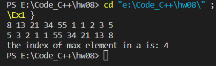
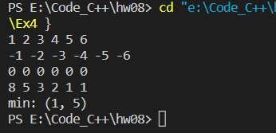
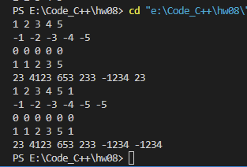
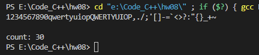
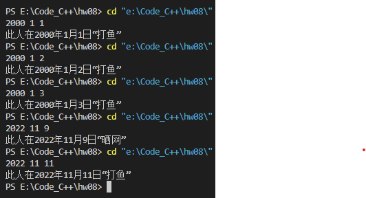

习题 1，4，5，10，12

## Ex1

##### 源代码

```c
#include <stdio.h>

int main() {
    int a[10];
    int max = 0;

    for (int i = 0; i < 10; i++) {
        scanf("%d", &a[i]);
    }

    for (int i = 9; i >= 0; i--) {
        printf("%d ", a[i]);
        max = a[i] > a[max] ? i : max;
    }
    printf("\nthe index of max element in a is: %d\n", max);

    return 0;
}
```


##### 运行结果


## Ex4
##### 源代码
```c
#include <stdio.h>

int main() {

    int a[4][6];
    int min_row = 0, min_col = 0;

    for (int i = 0; i < 4; i++) {
        for (int j = 0; j < 6; j++){
            scanf("%d", &a[i][j]);
            if (a[min_row][min_col] > a[i][j]) {
                min_row = i;
                min_col = j;
            }
        }
    }
    printf("min: (%d, %d)", min_row, min_col);

    return 0;
}
```
##### 运行结果


## Ex5
##### 源代码
```c
#include <stdio.h>

int main() {

    int a[5][5];
    int min[5];

    for (int i = 0; i < 5; i++) {
        for (int j = 0; j < 5; j++) {
            scanf("%d", &a[i][j]);
        }
    }    

    for (int i = 0; i < 5; i++) {
        min[i] = a[i][0];
        for (int j = 0; j < 5; j++) {
            printf("%d ", a[i][j]);
            if (min[i] > a[i][j])
                min[i] = a[i][j];
        }
        printf("%d\n", min[i]);
    }

    return 0;
}
```
##### 运行结果


## Ex10
##### 源代码
```c
#include <stdio.h>

int main() {

    char a;
    int count = 0;

    for (int i = 0; i < 50; i++) {
        scanf("%c", &a);
        if (('a' <= a && a <= 'z') || ('A' <= a && a <= 'Z') || ('0' <= a && a <= '9')) {
            count++;
        }
    }

    printf("\ncount: %d", count);

    return 0;
}
```
##### 运行结果


## Ex12
##### 源代码
```c
#include <stdio.h>

int isLeapYear(int year) {
    return ((year % 4 == 0) && (year % 100 != 0)) || (year % 400 == 0);
}

int dayOfYear(int year) {
    if (isLeapYear(year)) 
        return 366;
    return 365;
}

int dayOfMonth(int year, int month) {
    if (month == 1 || month == 3 || month == 5 || month == 7 || month == 8 || month == 10 || month == 12) 
        return 31;
    if (month == 2) 
        return 28 + isLeapYear(year);
    return 30;
}

int main() {

    int y, m, d, count = -1;
    scanf("%d%d%d", &y, &m, &d);

    for (int i = 2001; i <= y; i++) {    // 不包括2000年
        count += dayOfYear(i - 1);       // 算去年是不是闰年
    }
    for (int i = 2; i <= m; i++) {
        count += dayOfMonth(y, m - 1);
    }
    count += d;
    
    count %= 5;
    printf("此人在%d年%d月%d日“%s”", y, m, d, count <= 2 ? "打鱼" : "晒网");

    return 0;
}
```
##### 运行结果

