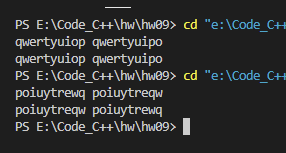
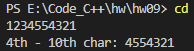
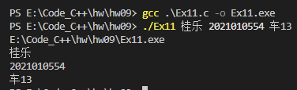
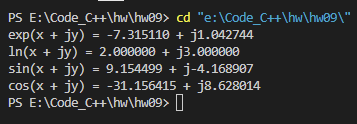
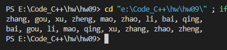

习题 1，2，4，11，12，13

# Ex1

1. `12`
2. `6`
3. `8`

# Ex2

##### 源代码

```c
#include <stdio.h>
#include <string.h>

int main() {

    char a1[100], a2[100];
    scanf("%s %s", a1, a2);

    if (strcmp(a1, a2) > 0)
        printf("%s %s", a2, a1);
    else
        printf("%s %s", a1, a2);

    return 0;
}
```


##### 运行结果



# Ex4

##### 源代码

```c
#include <stdio.h>

void disp(char *s, int n) {

    for (int i = 0; i < n; i++) {
        if (s[i] == '\0')
            break;
        printf("%c", s[i]);
    }
    printf("\n");
}

int main() {

    char str[11];
    scanf("%s", &str);

    printf("4th - 10th char: ");
    disp(&str[3], 7);

    return 0;
}
```


##### 运行结果



# Ex11

##### 源代码

```c
#include <stdio.h>

int main(int argc, char *argv[]) {

    for (int i = 0; i < argc; i++) {
        printf("%s\n", argv[i]);
    }

    return 0;
} 
```


##### 运行结果




# Ex12

##### 源代码

```c
#include <stdio.h>
#include <math.h>

void expCom(double* x, double* y, double* u, double* v) {
    double temp1 = *x, temp2 = *y;
    *u = exp(temp1) * cos(temp2);
    *v = exp(temp1) * sin(temp2);
}

void lnCom(double* x, double* y, double* u, double* v) {
    double temp1 = *x, temp2 = *y;
    *u = log(sqrt(temp1 * temp1 + temp2 * temp2));
    *v = atan2(temp2, temp1);            // atan与atan2不相同，atan2对象限敏感，因此接受两个参数
}

void sinCom(double* x, double* y, double* u, double* v) {
    double temp1 = *x, temp2 = *y;
    *u = sin(temp1) * (exp(temp2) + exp(-temp2)) / 2;
    *v = cos(temp1) * (exp(temp2) - exp(-temp2)) / 2;
}

void cosCom(double* x, double* y, double* u, double* v) {
    double temp1 = *x, temp2 = *y;
    *u = cos(temp1) * (exp(temp2) + exp(-temp2)) / 2;
    *v = -sin(temp1) * (exp(temp2) - exp(-temp2)) / 2;
}

int main() {
    
    // 分别定义一个函数指针数组和字符串数组来处理数据和输出数据
    void (*fun[4])(double*, double*, double*, double*) = {expCom, lnCom, sinCom, cosCom};
    char *a[] = {"exp", "ln", "sin", "cos"};
    double x = 2, y = 3;

    for (int i = 0; i < 4; i++) {
        (*fun[i])(&x, &y, &x, &y);
        printf("%s(x + jy) = %lf + j%lf\n", a[i], x, y);
    } 
    
    return 0;
}
```


##### 运行结果



# Ex13

##### 源代码

```c
#include <stdio.h>
#include <string.h>

void sortStr(char *str[], int n) {
    for (int i = 0; i < n -1; i++) {
        for (int j = 0; j < n - 1 - i; j++) {
            if (strcmp(str[j], str[j+1]) > 0) {
                char *temp = str[j];
                str[j] = str[j+1];
                str[j+1] = temp;
            }
        }
    }
}

void disp(char *str[], int n) {
    for (int i = 0; i < n; i++) {
        printf("%s, ", str[i]);
    }
}

int main() {

    char *a[] = {"zhang", "gou", "xu", "zheng", "mao", "zhao", "li", "bai", "qing"};
    
    disp(a, 9);
    sortStr(a, 9);
    printf("\n");
    disp(a, 9);

    return 0;
}
```


##### 运行结果


